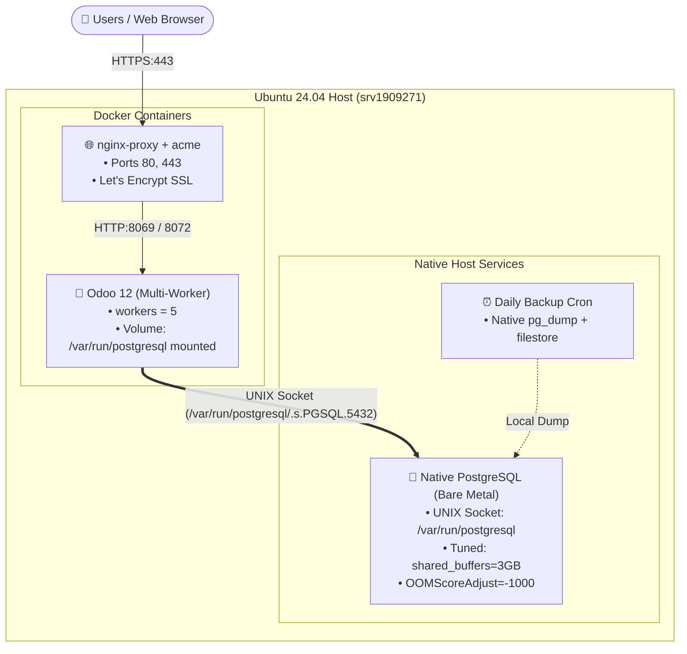

# Hybrid Architecture: Host PostgreSQL + Docker Odoo Design

**Date:** 2026-09-17  
**Status:** Proposed  
**Author:** Pair Programming (Antigravity & User)

---

## 1. Executive Summary
This design migrates our Odoo 12 deployment from a containerized PostgreSQL (`odoo-db` container) to a **Hybrid Architecture**:
- **PostgreSQL Database**: Runs natively on the Ubuntu host system.
- **Odoo 12 Application & Addons**: Runs in Docker (`odoo-web`), connecting directly to PostgreSQL via a mounted **UNIX domain socket** (`/var/run/postgresql`).
- **Nginx Reverse Proxy**: Continues running in Docker (`nginx-proxy` + `acme-companion`) handling SSL termination on ports 80/443.

This unlocks bare-metal database performance, prevents Out-Of-Memory (OOM) crashes from taking down PostgreSQL, and enables native backup and maintenance tooling directly on the host.

---

## 2. Architecture Diagram



---

## 3. Detailed Component Specifications

### 3.1 Host PostgreSQL Configuration
1. **Socket Access & Authentication (`/etc/postgresql/<version>/main/pg_hba.conf`)**:
   Keep the default `postgres` peer login intact, and add password-based authentication for the `odoo` user:
   ```text
   # Database administrative login by Unix domain socket (DO NOT TOUCH)
   local   all             postgres                                peer

   # Allow Odoo to authenticate via local Unix domain socket
   local   all             odoo                                    md5

   # "local" is for Unix domain socket connections only
   local   all             all                                     peer
   ```
2. **Resource & Buffer Tuning (`/etc/postgresql/<version>/main/postgresql.conf`)**:
   Tuned for a 4 vCPU / 8–16 GB RAM VPS:
   * `shared_buffers = 3GB`
   * `effective_cache_size = 8GB`
   * `work_mem = 32MB`
   * `maintenance_work_mem = 512MB`
   * `max_connections = 100`
3. **OOM Protection (Systemd Override)**:
   Ensure PostgreSQL is never killed during heavy Jasper reports or Python memory spikes:
   Create `/etc/systemd/system/postgresql.service.d/override.conf`:
   ```ini
   [Service]
   OOMScoreAdjust=-1000
   ```

### 3.2 Odoo Container Configuration
1. **UNIX Socket Mount in [`odoo/docker-compose.yml`](file:///d:/DeveloperMode/ViveCode/odoo12-docker-ubuntu24/odoo/docker-compose.yml)**:
   * Remove the `db` service definition and `internal-db` network.
   * Add `/var/run/postgresql:/var/run/postgresql` to `volumes`.
   * Update environment variables: `HOST=False`, `USER=odoo`, `PASSWORD=odoo`.
2. **Odoo Config ([`odoo/config/odoo.conf`](file:///d:/DeveloperMode/ViveCode/odoo12-docker-ubuntu24/odoo/config/odoo.conf))**:
   * `db_host = False` (triggers psycopg2 Unix domain socket connection)
   * `db_port = False`
   * `workers = 5` (1 cron worker + 4 HTTP request workers)
   * `limit_memory_soft = 2147483648` (2GB)
   * `limit_memory_hard = 2684354560` (2.5GB)
   * `limit_time_cpu = 120`
   * `limit_time_real = 240`
   * `proxy_mode = True`

### 3.3 Automated Deployment & Restore Scripts
1. **[`deploy.sh`](file:///d:/DeveloperMode/ViveCode/odoo12-docker-ubuntu24/deploy.sh)**:
   * Ensure native PostgreSQL is active (`systemctl is-active --quiet postgresql`).
   * Remove references to `odoo-db` container.
   * Run `odoo-web` with the `-v /var/run/postgresql:/var/run/postgresql` volume mount.
2. **[`restore.sh`](file:///d:/DeveloperMode/ViveCode/odoo12-docker-ubuntu24/restore.sh)**:
   * Replace `docker exec -i odoo-db psql ...` with native `psql -U odoo -d "$DB_NAME"` on the host.

---

## 4. Migration Plan (Zero Data Loss)

1. **Snapshot Existing Data**:
   * Dump the current database from the running `odoo-db` container:
     ```bash
     docker exec odoo-db pg_dump -U odoo -d yyy > /tmp/yyy_migration_dump.sql
     ```
2. **Configure Host PostgreSQL**:
   * Create the `odoo` role on the host:
     ```bash
     sudo -u postgres createuser -s odoo
     sudo -u postgres psql -c "ALTER USER odoo WITH PASSWORD 'odoo';"
     ```
   * Add `local all odoo md5` to `pg_hba.conf` and reload PostgreSQL.
   * Create database `yyy` and restore the dump:
     ```bash
     sudo -u postgres createdb -O odoo yyy
     sudo -u postgres psql -d yyy < /tmp/yyy_migration_dump.sql
     ```
3. **Switch Odoo to Host Socket**:
   * Pull updated code containing the new volume mount and `odoo.conf` socket settings.
   * Run `./deploy.sh`.
4. **Validation**:
   * Verify Odoo successfully logs into database `yyy` via `/var/run/postgresql`.
   * Stop and remove the old `odoo-db` container and volume.
